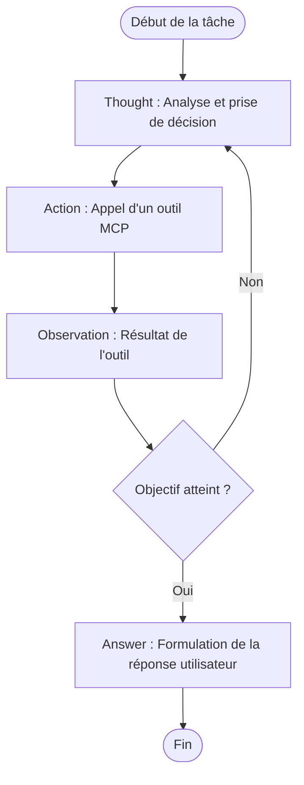
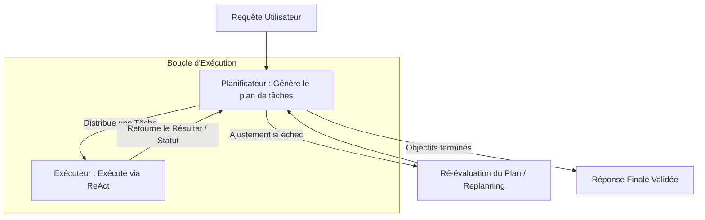

# Étude des Patterns d'Agents : ReAct et Plan-and-Solve (Jour 8)

Ce document présente une analyse technique approfondie des deux modèles majeurs de raisonnement d'agents autonomes à agent unique (*Single-Agent*) : le pattern **ReAct (Reason and Act)** et le pattern **Plan-and-Solve (Planification Dynamique)**. Il détaille également le cycle fondamental **Planifier $\rightarrow$ Agir $\rightarrow$ Valider** et formalise par des diagrammes le comportement d'un agent de correction automatique de bugs.

---

## 1. Le Pattern ReAct (Reason and Act)

Le pattern **ReAct** (proposé par Yao et al. en 2022) combine le raisonnement par chaîne de pensée (*Chain of Thought*) et l'exécution d'actions spécifiques à travers des appels d'outils (*Tool Calls*). Cette synergie permet à l'agent de résoudre des tâches complexes de manière itérative et interactive.

### A. Le Cycle Interne ReAct
Le cycle interne de ReAct repose sur une boucle à quatre étapes :
1. **Pensée (Thought)** : Le modèle analyse la situation actuelle, formule des hypothèses et décide de l'action la plus pertinente à mener pour progresser vers l'objectif.
2. **Action (Tool Call)** : Le modèle génère un appel d'outil structuré (généralement au format JSON) décrivant l'outil à appeler et ses paramètres.
3. **Observation (Tool Output)** : Le système exécute l'outil et réinjecte le résultat brut (ou formaté) dans le contexte du modèle.
4. **Pensée Suivante** : Le modèle évalue le résultat obtenu et décide soit de poursuivre la boucle, soit de formuler la réponse finale.



### B. Défis Techniques & Solutions de Conception

#### 1. Robustesse des Parsers d'Actions
Le modèle doit générer des appels d'outils conformes à un schéma strict (ex. JSON Schema). En pratique, les LLM peuvent faire des erreurs de syntaxe (JSON mal formé, balises Markdown imbriquées, paramètres manquants).
* **Solution** : Implémenter des **parsers tolérants aux pannes** capables de nettoyer les balises Markdown (` ```json ... ``` `), de réparer des JSON partiels (via des heuristiques ou des sous-modèles de correction rapide) et de lever des exceptions descriptives réinjectées sous forme d'observations pour que l'agent s'auto-corrige au tour suivant.

#### 2. Gestion du Bruit de l'Observation
Les sorties d'outils peuvent être extrêmement volumineuses (ex. une sortie de console de build, un dump de base de données ou un fichier de log entier). Réinjecter ces données brutes sature instantanément la fenêtre de contexte et augmente drastiquement les coûts de token.
* **Solution (Rolling Summarization)** : Mettre en place un middleware d'exécution d'outils qui filtre, tronque ou résume la sortie de l'outil avant de la présenter au modèle. Par exemple, si un outil lit un fichier de logs, l'agent reçoit un résumé ou uniquement les lignes d'erreur pertinentes.

#### 3. Backtracking & Évitement de Boucles Infinies
Un agent ReAct peut se retrouver bloqué dans une boucle infinie s'il répète la même action infructueuse ou si un outil échoue systématiquement de la même manière.
* **Solution (Machine à États & Registre d'Actions)** : Maintenir un registre historique des actions déjà tentées dans la session. Si l'agent tente d'exécuter exactement le même appel d'outil avec les mêmes paramètres pour la troisième fois sans progrès, le framework de l'agent intercepte l'appel, modifie le prompt système temporairement pour signaler la boucle ("*You are in a loop. Try a different strategy or inspect your previous assumptions*") et force un changement de stratégie.

---

## 2. Le Pattern Plan-and-Solve (Planification Dynamique)

Contrairement à ReAct qui progresse "au pas à pas" de manière très opportuniste (et parfois erratique), le pattern **Plan-and-Solve** sépare la conception de la stratégie globale de son exécution technique.

### A. Découplage Planificateur / Exécuteur
* **Le Planificateur (High-Level Orchestrator)** : Analyser la requête utilisateur et générer un plan d'action structuré sous forme d'un graphe orienté acyclique (DAG) ou d'une liste ordonnée de tâches. Son rôle est de garder une vision macroscopique du projet sans se soucier du détail d'implémentation de chaque tâche.
* **L'Exécuteur (Low-Level Actor)** : Prendre une tâche spécifique du plan, l'exécuter en utilisant des boucles ReAct courtes et spécialisées, puis retourner le résultat au planificateur.



### B. Gestion de Plan Dynamique (Dynamic Replanning)
Un plan statique résiste rarement au premier contact avec la réalité (erreurs de compilation, tests échoués, dépendances manquantes). L'agent doit donc être capable de faire du **Replanning**.
1. **Stateful Plan Manager** : Le planificateur gère un tableau d'état des tâches :
   * `PENDING` (En attente)
   * `RUNNING` (En cours)
   * `COMPLETED` (Terminé avec succès)
   * `FAILED` (Échoué)
2. **Rétroaction sur Échec** : En cas d'échec d'une étape, le planificateur n'abandonne pas la tâche globale. Il prend l'erreur comme une nouvelle entrée, marque l'étape comme `FAILED`, et génère un plan alternatif (ex. insérer des étapes de diagnostic, modifier les étapes suivantes ou faire marche arrière).

---

## 3. Le Cycle Fondamental "Planifier $\rightarrow$ Agir $\rightarrow$ Valider"

Pour tout agent d'ingénierie logicielle professionnel, **la validation est l'unique chemin vers la finalité**. Un changement de code non validé n'existe pas.

Le cycle s'articule ainsi :
1. **Planifier** : Définir la cible, les fichiers à modifier et, de manière critique, **la stratégie de test** permettant de prouver que la modification est correcte.
2. **Agir** : Appliquer les modifications chirurgicales de code (via des outils comme `replace` ou `write_file`).
3. **Valider** : Exécuter la suite de tests unitaires/d'intégration ou lancer des scripts d'analyse statique (comme notre validateur de blocage réactif). Si la validation échoue, l'agent doit analyser l'erreur de compilation ou le rapport de test, adapter sa stratégie, et ré-exécuter le cycle (Backtracking).

---

## 4. Exercice Pratique : Modélisation d'un Agent de Correction de Bugs (Bug-Fixing Agent)

Voici la formalisation sous forme de diagramme d'état (State Machine) du comportement d'un agent autonome dont l'objectif est de corriger un bug signalé dans l'application.

Ce modèle montre comment l'agent intègre le développement dirigé par les tests (TDD) pour reproduire empiriquement le bug avant d'appliquer un correctif, assurant ainsi une validation totale sans régression.

```mermaid
stateDiagram-v2
    [*] --> Research : Réception du rapport de bug
    
    state Research {
        [*] --> MapCodebase : Analyse de l'arborescence
        MapCodebase --> SearchSymbols : Recherche des symboles pertinents (grep_search)
        SearchSymbols --> ReadFiles : Lecture ciblée du code source (read_file)
        ReadFiles --> IdentifyRootCause : Identification de la cause racine
    }
    
    Research --> WriteReproductionTest : Cause identifiée
    
    state WriteReproductionTest {
        [*] --> CreateTest : Écriture d'un test unitaire reproduisant le bug
        CreateTest --> RunTestReproduction : Exécution du test de reproduction
        RunTestReproduction --> ConfirmFailure : Le test ÉCHOUE (Bug reproduit empiriquement)
        RunTestReproduction --> FixTestAssumption : Le test REUSSIT (Hypothèse erronée)
        FixTestAssumption --> CreateTest : Ajustement du scénario de test
    }
    
    WriteReproductionTest --> ApplyFix : Bug reproduit avec succès
    
    state ApplyFix {
        [*] --> DraftFix : Élaboration du correctif minimaliste
        DraftFix --> ApplyCodeChanges : Modification chirurgicale (replace / write_file)
    }
    
    ApplyFix --> RunValidation : Correctif appliqué
    
    state RunValidation {
        [*] --> RunSpecificTest : Exécution du test de reproduction
        RunSpecificTest --> RunSuite : Le test REUSSIT (Correctif valide)
        RunSuite --> BuildAndLint : La suite de tests globale passe
        BuildAndLint --> VerificationSuccess : Build & Linters OK
        
        RunSpecificTest --> FixFailureDiagnostic : Le test ÉCHOUE toujours (Correctif incorrect)
        RunSuite --> RegressionDiagnostic : Régression détectée sur d'autres tests
        BuildAndLint --> CompilationDiagnostic : Erreur de compilation ou de linter
    }
    
    RunValidation --> Backtracking : Échec (Compilation / Test / Régression)
    
    state Backtracking {
        [*] --> AnalyzeError : Étude fine du message d'erreur
        AnalyzeError --> RevertChanges : Annulation des modifications incohérentes
        RevertChanges --> ReformulateStrategy : Ré-évaluation des hypothèses (Max 3 tentatives)
    }
    
    Backtracking --> ApplyFix : Nouvelle stratégie formulée
    Backtracking --> EscalateToUser : Épuisement des tentatives (3 échecs consécutifs)
    
    RunValidation --> CommitAndDeliver : Validation complète réussie (Success)
    
    state CommitAndDeliver {
        [*] --> StageChanges : git add <fichiers modifiés uniquement>
        StageChanges --> DraftCommitMessage : Rédaction d'un message structuré (Conventional Commits)
        DraftCommitMessage --> Commit : Execution de git commit
        Commit --> ConfirmStatus : git status de confirmation
    }
    
    CommitAndDeliver --> [*] : Bug corrigé et livré avec succès !
    EscalateToUser --> [*] : Escalade pour intervention humaine
```



---

## 5. Synthèse comparative : ReAct vs Plan-and-Solve

| Dimension | ReAct (Reason and Act) | Plan-and-Solve |
| :--- | :--- | :--- |
| **Philosophie** | Approche tactique pas-à-pas. L'action découle directement de la dernière observation. | Approche stratégique globale. Planifie les grandes étapes à l'avance puis les exécute. |
| **Complexité de Tâche** | Idéal pour les tâches courtes, interactives ou exploratoires. | Indispensable pour les refactoring larges, les migrations ou les nouvelles fonctionnalités multi-fichiers. |
| **Consommation Contextuelle** | Élevée en cas de longue boucle (risque d'accumulation de bruit et de répétition). | Modérée car les sous-tâches s'exécutent dans des fenêtres isolées, consolidées ensuite pour le planificateur. |
| **Résilience** | Sensible aux boucles infinies en cas d'erreur répétée sur un outil. | Très robuste grâce au mécanisme de ré-ordonnancement dynamique (Replanning). |
| **Alignement Normes Projet** | Peut être distrait par les détails immédiats et oublier les directives globales. | Assure une conformité maximale car le planificateur valide chaque livrable par rapport aux standards globaux. |
