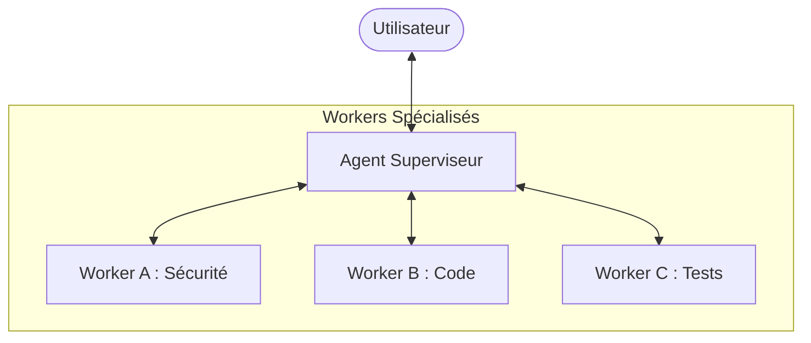
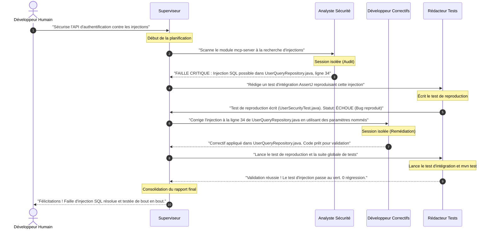

# Architecture Multi-Agents & Délégation (Jour 9)

Ce document explore les concepts avancés de la collaboration multi-agents, les topologies d'orchestration et les techniques de compression de contexte. Il présente également l'exercice pratique de conception d'un système multi-agents de sécurité.

---

## 1. Pourquoi le Multi-Agents ? Les limites du Single-Agent

Lorsqu'un seul agent gère une tâche complexe, il se heurte rapidement à trois limites majeures :

1. **La saturation de la fenêtre de contexte** : Chaque tour d'appel d'outil ajoute des milliers de tokens à la conversation (requêtes, codes, logs). Très vite, l'agent dépasse la capacité optimale d'attention du LLM (*loss in the middle*), ce qui dégrade ses performances et augmente considérablement le coût.
2. **Le conflit de rôles (Cognitive Overload)** : Demander au même agent d'être à la fois un chercheur de failles pointilleux, un développeur rapide et un testeur maniaque crée des contradictions dans son prompt système. Un agent spécialisé dans un seul rôle est toujours plus performant.
3. **Le manque de parallélisme** : Un agent unique exécute ses tâches de manière purement séquentielle. Dans un système multi-agents, plusieurs agents peuvent travailler en parallèle sur des sous-tâches indépendantes.

---

## 2. Topologies d'Orchestration Multi-Agents

Il existe trois grandes manières d'organiser la communication et le travail entre plusieurs agents :

### A. La topologie Superviseur-Worker (Hiérarchique)
C'est l'approche la plus courante et la plus structurée.
* **Le Superviseur (Orchestrateur)** : Reçoit la requête utilisateur, la décompose en sous-tâches, délègue chaque tâche à un agent spécialisé (Worker), reçoit leurs rapports, et assemble la réponse finale.
* **Les Workers (Exécuteurs)** : Sont des agents ultra-spécialisés dotés d'outils précis. Ils ne parlent pas directement à l'utilisateur, uniquement au superviseur.

### B. La Chorégraphie Réactive (Peer-to-Peer)
Dans cette topologie, il n'y a pas de chef. Les agents collaborent via un bus d'événements commun ou un état partagé (*Blackboard*).
* Chaque agent surveille le tableau de bord.
* Lorsqu'un agent voit une tâche correspondant à sa spécialité (ex: "*Code écrit, en attente de tests*"), il s'en saisit, l'exécute, et publie le résultat ("*Tests écrits, statut vert*").

### C. Le Routage Sémantique (Semantic Routing)
Un routeur sémantique léger analyse la requête initiale et l'oriente directement vers le meilleur agent spécialisé. Contrairement au Superviseur-Worker, il n'y a pas de va-et-vient ; le routeur passe simplement le relais.

---

## 3. Le Secret Industriel : La Compression de Contexte par Délégation

La délégation de tâches permet de réaliser ce qu'on appelle la **compression de contexte**.

### Le Principe d'Échange d'Historique :
Imaginons qu'un agent Superviseur confie la correction d'une classe Java complexe à un agent Développeur (Worker) :
1. Le Worker démarre une **nouvelle session/conversation isolée** avec le LLM.
2. Pour corriger le bug, le Worker fait **10 tours de boucle ReAct** (lectures de fichiers, essais de code, erreurs de syntaxe, corrections). Cette conversation privée consomme **50 000 tokens**.
3. Une fois le travail terminé, le Worker ne transmet pas tout son historique de 10 tours au Superviseur.
4. Il génère un **rapport de synthèse condensé** (ex: 500 tokens) :
   > *"Tâche complétée : Classe `WeatherService.java` corrigée à la ligne 45. Le test `WeatherServiceTest.java` passe au vert. Aucun effet de bord détecté."*
5. Le Superviseur réinjecte uniquement ce rapport condensé dans son propre historique.

**Bilan** : Le Superviseur a bénéficié de 50 000 tokens de travail pour un coût de seulement 500 tokens dans sa fenêtre de contexte. La mémoire globale reste propre et ultra-rapide.

---

## 4. Exercice Pratique : Système Multi-Agents de Sécurité

Nous allons concevoir l'architecture d'un système multi-agents d'élite chargé de **détecter, corriger et tester** des failles de sécurité dans notre codebase.

### Fiches de Rôle des Agents

#### 1. L'Analyste de Sécurité (Security Analyst)
* **Prompt Système** : *"Vous êtes un expert en cybersécurité et en audit de code statique (SAST). Votre rôle est de scanner le code pour identifier les vulnérabilités (OWASP Top 10, injections SQL, dépendances obsolètes). Vous ne modifiez jamais de code. Vous rédigez des rapports de vulnérabilité précis incluant la cause racine, le fichier, la ligne et le niveau de sévérité (CRITICAL/HIGH)."*
* **Outils (MCP)** : Accès en lecture seule au code (`read_file`, `grep_search`), outils de scan de vulnérabilités (ex: `security_scanner`).

#### 2. Le Développeur de Correctifs (Patch Developer)
* **Prompt Système** : *"Vous êtes un ingénieur logiciel senior spécialisé dans la remédiation de failles de sécurité. Votre rôle est de prendre un rapport de vulnérabilité et de concevoir le correctif de code le plus minimal et le plus sûr possible. Vous devez respecter strictement les standards d'architecture du projet (GEMINI.md)."*
* **Outils (MCP)** : Accès en écriture au code (`replace`, `write_file`).

#### 3. Le Rédacteur de Tests (Test Writer)
* **Prompt Système** : *"Vous êtes un ingénieur QA et un spécialiste du Test-Driven Development (TDD). Votre rôle est de rédiger des tests unitaires et d'intégration robustes pour prouver qu'une faille de sécurité a été corrigée et qu'aucune régression n'a été introduite. Vous utilisez exclusivement AssertJ (`assertThat`)."*
* **Outils (MCP)** : Accès en écriture aux fichiers de test, exécuteur de tests (`run_shell_command`).

---

### Diagramme de Collaboration (Séquence)

Voici comment nos trois agents collaborent sous l'égide du Superviseur pour corriger une vulnérabilité d'injection SQL :

---

## 5. Synthèse comparative des interactions Multi-Agents

| Agent | Rôle Primaire | Outils Clés | Type d'Inputs | Type d'Outputs |
| :--- | :--- | :--- | :--- | :--- |
| **Superviseur** | Coordinateur & Arbitre | Aucun (ou routeur) | Requête humaine brute | Rapport de livraison final |
| **Analyst** | Détecteur de failles | `grep_search`, `read_file` | Code source brut | Rapport de faille structuré |
| **Tester** | Garant de la qualité | `write_file`, test runner | Spécification de faille / Correctif | Statut de test (Vert/Rouge) |
| **Dev** | Remédiateur de code | `replace`, `write_file` | Rapport de faille + Code source | Fichier de code modifié |
